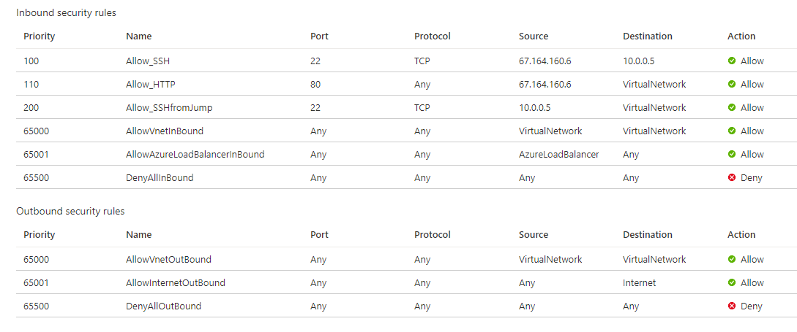
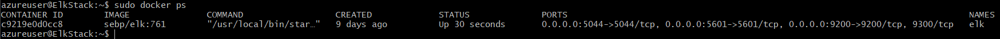
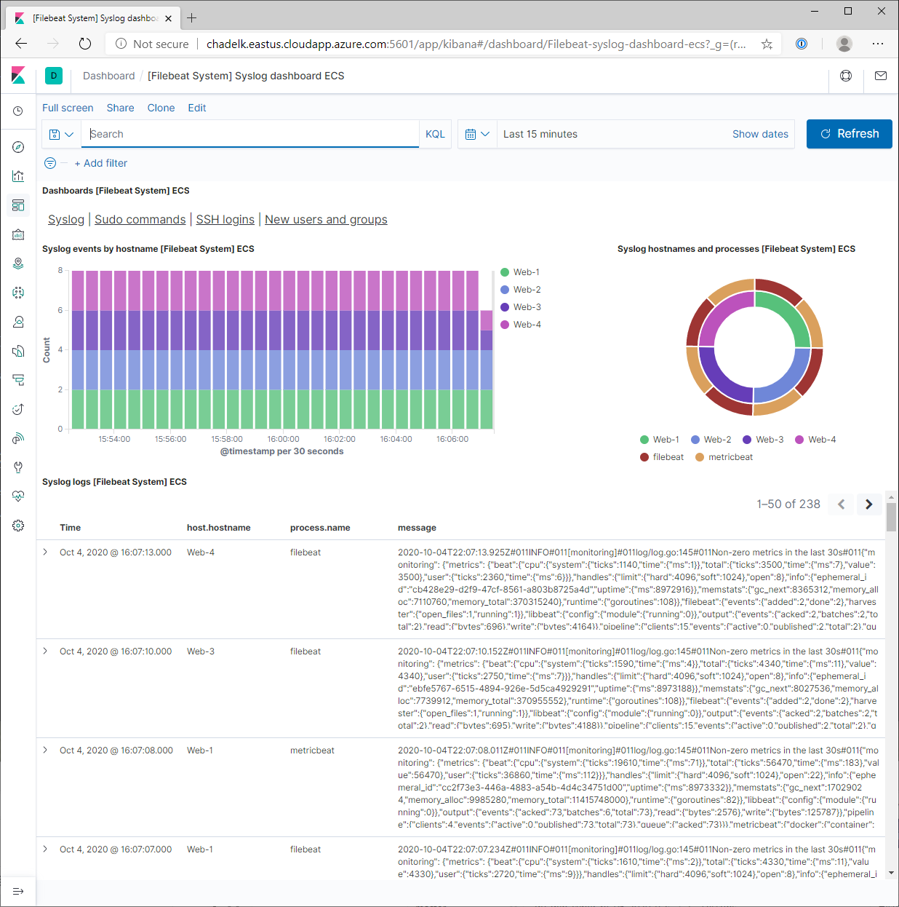

## Automated ELK Stack Deployment

This document contains the following details:
- Description of the Topology
- Access Policies
- ELK Configuration
  - Beats in Use
  - Machines Being Monitored
- How to Use the Ansible Build

---
### Description of the Topology

The files in this repository were used to configure the IaC network in Azure as depicted below.


_Alternatively, select portions of the **[webservers.yml](Ansible)** file may be used to install only certain pieces of it, such as Filebeat._

The main purpose of this network is to expose a load-balanced and monitored instance of DVWA, the Damn Vulnerable Web Application.  
Load balancing ensures that the application will be highly available by sharing incoming traffic amoung the vulnerable web servers. In addition, inbound access to the network will be restricted through access controls so only authorized users will be able to connect.

Integrating an ELK server allows users to easily monitor for changes to the file systems of the VMs on the network and as well as watch system metrics, such as CPU usage; attempted SSH logins; sudo escalation failures; etc.

The configuration details of each machine may be found below.

| Name      | Function   | IP Address | Operating System |
|-----------|------------|------------|------------------|
| Jump Box  | Gateway    | 10.0.0.5   | Linux            |
| Web-1     | Web Server | 10.0.0.6   | Linux            |
| Web-2     | Web Server | 10.0.0.7   | Linux            |
| Web-3     | Web Server | 10.1.0.6   | Linux            |
| Web-4     | Web Server | 10.1.0.7   | Linux            |
| ELK Stack | Monitoring | 10.1.0.5   | Linux            |

In addition to the above, Azure has provisioned a **load balancer** in front of all machines except for the jump box.  
The load balancer's targets are organized into the following availability zones:
- **Availability Zone 1**: Web-1 + Web-2
- **Availability Zone 2**: Web-3 + Web-4

---
### Access Policies

The machines on the internal network are not exposed to the public Internet, and can only be accessed internally.  

Only the **Jump Box** machine can accept connections from the Internet. Access to this machine is only allowed from the following IP addresses:
- 67.164.160.6

A summary of the access policies in place can be found in the Azure screenshot below.



---
### Elk Configuration

Ansible was used to automate configuration of the ELK machine. No configuration was performed manually, which is advantageous because...
- _TODO: What is the main advantage of automating configuration with Ansible?_

The **[Elkserver playbook](Ansible/elkserver.yml)** implements the following tasks:
- Install Docker.io
- Install pip3
- Install Docker python module
- Increase virtual memory for ELK
- Download and launch ELK container

```yaml
---
# elkserver.yml
- name: Configure Elk VM with Docker
  hosts: elkservers
  remote_user: elk
  become: true
  tasks:

    - name: Install docker.io
      apt:
        update_cache: yes
        name: docker.io
        state: present

    - name: Install pip3
      apt:
        force_apt_get: yes
        name: python3-pip
        state: present

    - name: Install Docker python module
      pip:
        name: docker
        state: present

    - name: Use more memory
      sysctl:
        name: vm.max_map_count
        value: "262144"
        state: present
        reload: yes

    - name: Download and Launch a docker elk container
      docker_container:
        name: elk
        image: sebp/elk:761
        state: started
        restart_policy: always
        # Please list the ports ELK runs on
        published_ports:
          - 5601:5601
          - 9200:9200
          - 5044:5044
```

The following screenshot displays the result of running `docker ps` after successfully configuring the ELK instance.



---
### Target Machines & Beats
This ELK server is configured to monitor the following machines:

| Name      | IP Address | 
|-----------|------------|
| Web-1     | 10.0.0.6   | 
| Web-2     | 10.0.0.7   | 
| Web-3     | 10.1.0.6   |
| Web-4     | 10.1.0.7   |

The following Beats are intsalled on these machines, allowing the collection of the following information from each machine:

- **Filebeat**: detects changes to the filesystem. Specifically, used to collect Apache logs.
- **Metricbeat**:  detects changes in system metrics. Detects SSH login attempts, failed `sudo` escalations, and CPU/RAM statistics.


The playbook below installs Metricbeat on the target hosts. The playbook for installing Filebeat is not included, but looks essentially identical — simply replace metricbeat with filebeat, and it will work as expected.

```yaml
- name: download metricbeat deb
  command: curl -L -O https://artifacts.elastic.co/downloads/beats/metricbeat/metricbeat-7.4.0-amd64.deb

- name: install metricbeat deb
  command: dpkg -i metricbeat-7.4.0-amd64.deb

- name: drop in metricbeat.yml
  copy:
    src: /etc/ansible/roles/metricbeat/files/metricbeat-config.yml
    dest: /etc/metricbeat/metricbeat.yml

- name: enable and configure system module
  command: metricbeat modules enable system

- name: setup metricbeat
  command: metricbeat setup

- name: start metricbeat service
  systemd:
    name: metricbeat
    state: started
    enabled: yes
 ```

---
### Using the Playbook
In order to use the playbooks, you will need to have an Ansible Control Node already configured. The diagramed **Jump Box** has been configured for this purpose. 

SSH into the control node and follow the steps below:
- Copy the playbooks to the Ansible Control Node **(Jump Box)**
- Run each playbook on the appropriate targets

The easiest way to copy the playbooks is to use Git:

```bash
$ cd /etc/ansible
# Clone Repository + IaC Files
$ git clone https://github.com/chadhammond01/Azure_ELK_Project.git
# Move Playbooks, roles, and hosts files Into `/etc/ansible`
$ cp Azure_ELK_Project/Ansible/* -R .
```

This copies the playbooks and required files to the correct place.

Next, you must edit the `hosts` file to specify which VMs to run each playbook on. For example:

```
 [webservers]
10.0.0.6 ansible_python_interpreter=/usr/bin/python3
10.0.0.7 ansible_python_interpreter=/usr/bin/python3
10.1.0.6 ansible_python_interpreter=/usr/bin/python3
10.1.0.7 ansible_python_interpreter=/usr/bin/python3

 [elkservers]
10.1.0.5 ansible_python_interpreter=/usr/bin/python3
```

After this, the commands below run the playbooks:

 ```bash
 $ cd /etc/ansible
 $ ansible-playbook elkserver.yml elkservers
 $ ansible-playbook webserver.yml webservers
 ```
 
To verify successfull installation of the webservers, run `curl http://10.0.0.6:80/setup.php`. If the installation succeeded, this command should print HTML to the console.

To verify successfull installation of the ELK server, wait five minutes to give ELK time to start up.  
Then, run: `curl http://10.1.0.5:5601/app/kibana`. If the installation succeeded, this command should print HTML to the console.


